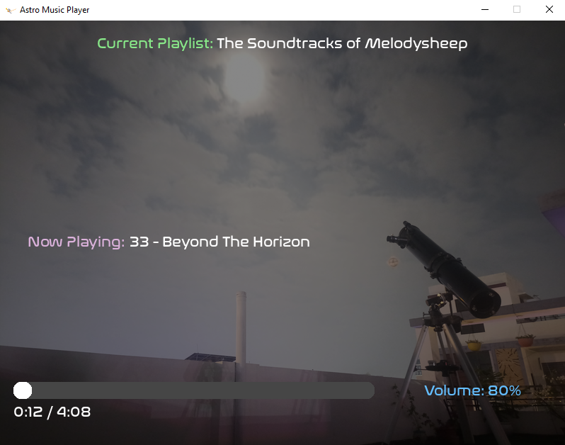
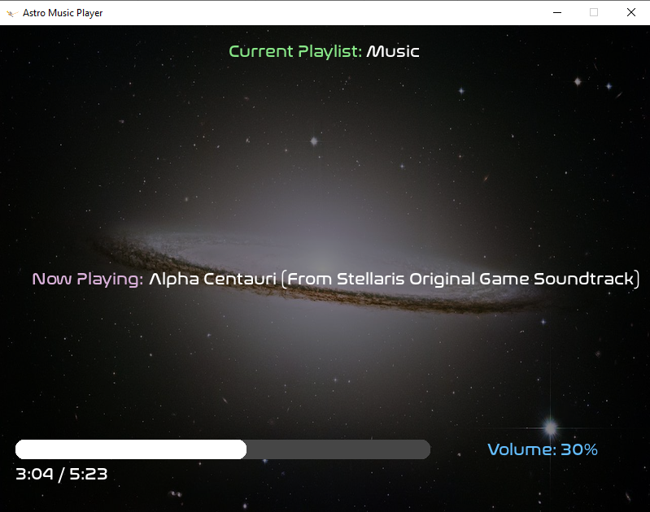

# AstroPlayer
**A lightweight Astronomy-Themed local Music Player built with Python on a weekend just for fun!**

_**Backstory:**_ I was originally trying to make a simple python script using pygame to randomly play some of my downloaded Melodysheep music while i study. Then one thing led to another, I kept adding some features i liked, Took some help from ChatGPT and thus AstroPlayer was born!

## Screenshots

## Features
- Multiple playlists Support
- Random Messier/Space backgrounds
- Progress bar for the current Song
- Seekable playback (Via clicking the Progress Bar)
- Global volume controls (Works even when AstroPlayer is not Focused)
- Pause/Resume
- Previous/Next track
- Automatic playlist shuffling

## Controls
| Key | Action |
|------|--------|
| ← / → | Previous / Next Track |
| Space | Pause / Resume |
| + / - | Global Volume Control |
| , / . | Switch Playlists |
| Esc | Exit |

## Customization
- To add your own Background images, Replace or Add New `.jpg` files in the Assets/Images folder. The Program will include them automatically.
- To add your Music, You can place new `.mp3` or `.wav` or `.ogg` in a Playlist folder under the Assets/Playlists folder or remove the ones you don't like from the same. The Program will Auto-Update on the next Start.
- You can further organise your songs by creating as many playlists as you like, You can do so by creating a folder inside Assets/Playlists and it will count as a New Playlist (For ex. Study, Cozy, Space etc) in the Program after a restart.

## Requirements
- Windows
- Python 3.12+ and the Program's Dependencies (to run the python source code)
- Or download the pre-built executable from the Releases page.

## License
This project is licensed under the MIT License.

**Note:** AstroPlayer requires at least one supported audio file (`.mp3`, `.wav`, or `.ogg`) in one of the playlist folders to start playback.

- You can Download the latest pre-built executable from the **Releases** page, or run the source code using Python.

_**Thanks a lot for your time! Cya later :D**_
